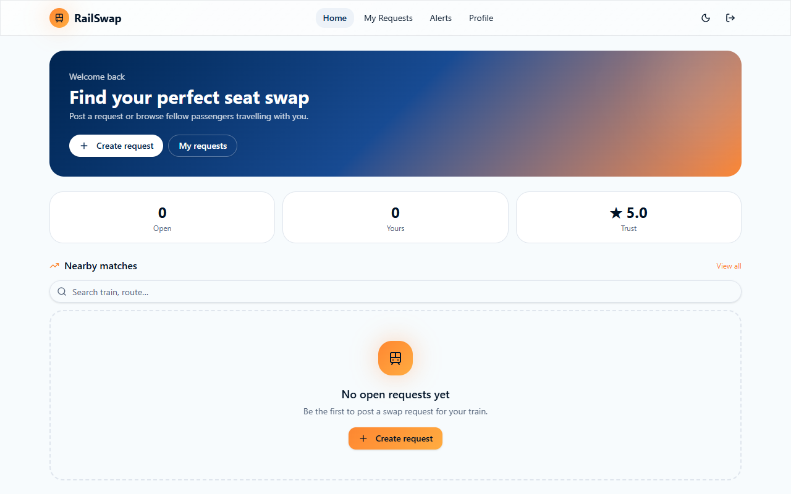
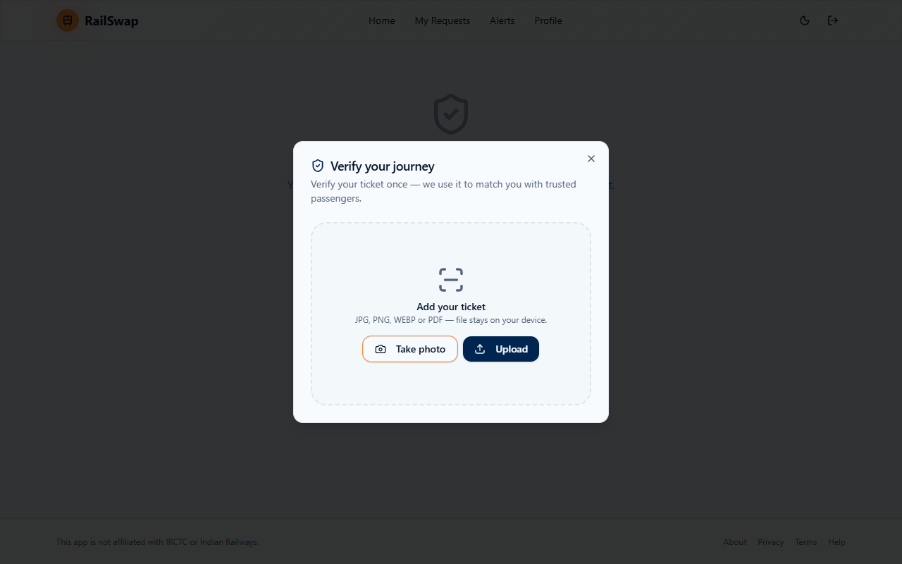
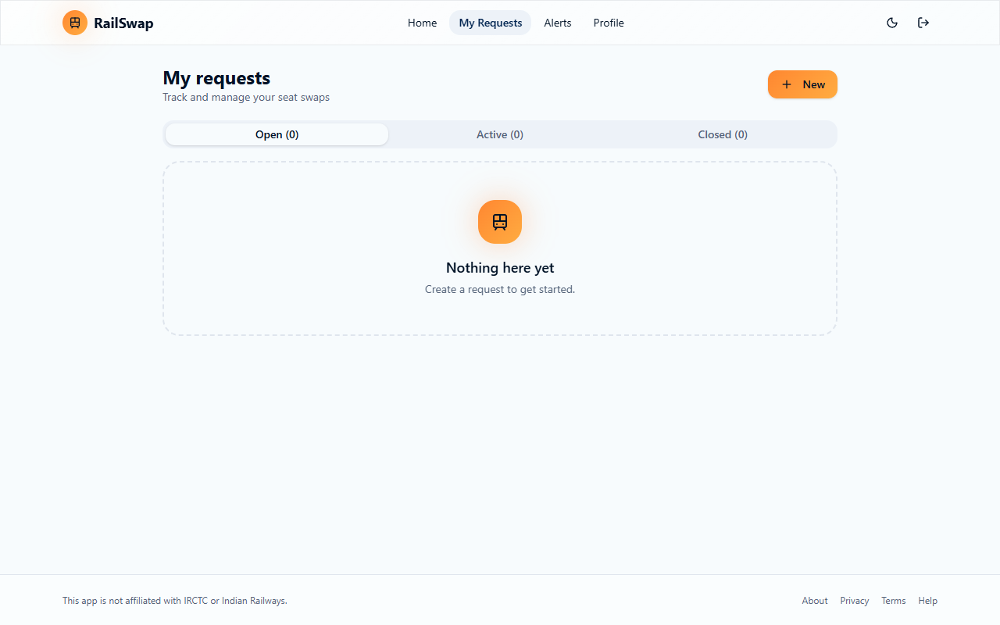
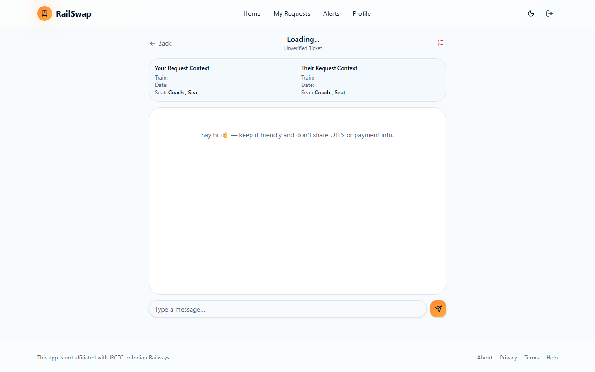

# 🚆 RailSwap — Train Seat Swap & Passenger Companion Hub

RailSwap is an AI-powered, full-stack web application designed for train travelers across Indian Railways. It allows passengers to verify IRCTC tickets automatically via OCR/PDF parsing or live 10-digit PNR fetching, post confirmed seat swap requests, and coordinate seat exchanges via real-time chat.

---

## 🌟 Key Features

### 1. 🎟️ Ticket Verification System (OCR, PDF & PNR API)
- **PDF & Image Ticket Parsing**: Upload IRCTC e-tickets (PDF, JPG, PNG) to extract train number, journey date, boarding/destination stations, coach number, seat number, berth, and passenger names.
- **Live RailRadar PNR API Integration**: Enter any 10-digit PNR number to query the live RailRadar PNR API (`https://api.railradar.in/v1/pnr/{pnr}`) for real-time confirmation status.

### 2. 🔐 Direct Database Authentication
- **Fast Signup & Login**: Saves user credentials directly in Supabase's `public.profiles` table (`email`, `password`, `name`, `verified`).
- **Instant Access**: Bypasses email confirmation loops for frictionless onboarding with session persistence in `localStorage`.

### 3. 💬 Real-Time Passenger Chat
- **Instant Messaging**: Built with Supabase WebSockets (`supabase_realtime`) allowing passengers negotiating seat swaps to chat in real time.
- **Read Receipts & Unread Badges**: Real-time read status updates when messages are viewed.

### 4. 📊 Dashboard & Match Discovery
- **Smart Route Matching**: Filters swap requests based on matching train numbers, travel dates, and compatible berth choices (e.g. Side Lower $\leftrightarrow$ Middle Berth).

---

## 📸 Screenshots & Workflow

### 1. User Dashboard

*The main dashboard displaying active verified journey tickets, nearby seat swap matches, and real-time activity metrics.*

### 2. Ticket Upload & Verification

*Passengers upload their IRCTC ticket (PDF/Image) or enter a 10-digit PNR. The system automatically extracts journey details.*

### 3. Swap Request Details

*Detailed view of a seat swap request displaying coach, seat numbers, journey date, route, and verification badges.*

### 4. Real-Time Chat Interface

*Secure, real-time messaging interface powered by Supabase for passengers to coordinate seat swaps prior to boarding.*

---

## ⚙️ SQL Setup Scripts Included in Project

| Script Name | Description |
| :--- | :--- |
| `RESET_AND_CLEAN_DATABASE.sql` | Master SQL script to reset database, create tables, RLS policies, triggers, and storage. |
| `fix_all_rls_policies.sql` | Enables open access RLS policies for direct database authentication. |
| `fix_foreign_keys.sql` | Updates foreign keys on `messages`, `requests`, `notifications` to point to `public.profiles(id)`. |
| `add_email_to_profiles.sql` | Adds `email` & `password` columns and reloads PostgREST schema cache (`NOTIFY pgrst`). |
| `delete_test_data.sql` | Utility query to delete duplicate/test swap requests. |

---

## 🚀 How to Run Locally

1. **Clone & Install Dependencies**:
   ```bash
   git clone https://github.com/mscharan6303/Rail_Swap.git
   cd Rail_Swap
   npm install
   ```

2. **Configure Environment Variables**:
   Update `.env` with your Supabase credentials:
   ```env
   VITE_SUPABASE_URL=https://wchnwauhoaxsrxfkjxem.supabase.co
   VITE_SUPABASE_PUBLISHABLE_KEY=sb_publishable_kWHNLPTZM_33fR7SqaPMhQ_86YRArtD
   SUPABASE_URL=https://wchnwauhoaxsrxfkjxem.supabase.co
   SUPABASE_PUBLISHABLE_KEY=sb_publishable_kWHNLPTZM_33fR7SqaPMhQ_86YRArtD
   ```

3. **Start Development Server**:
   ```bash
   npm run dev
   ```
   Access the web app at `http://localhost:5173/Rail_Swap/`.
