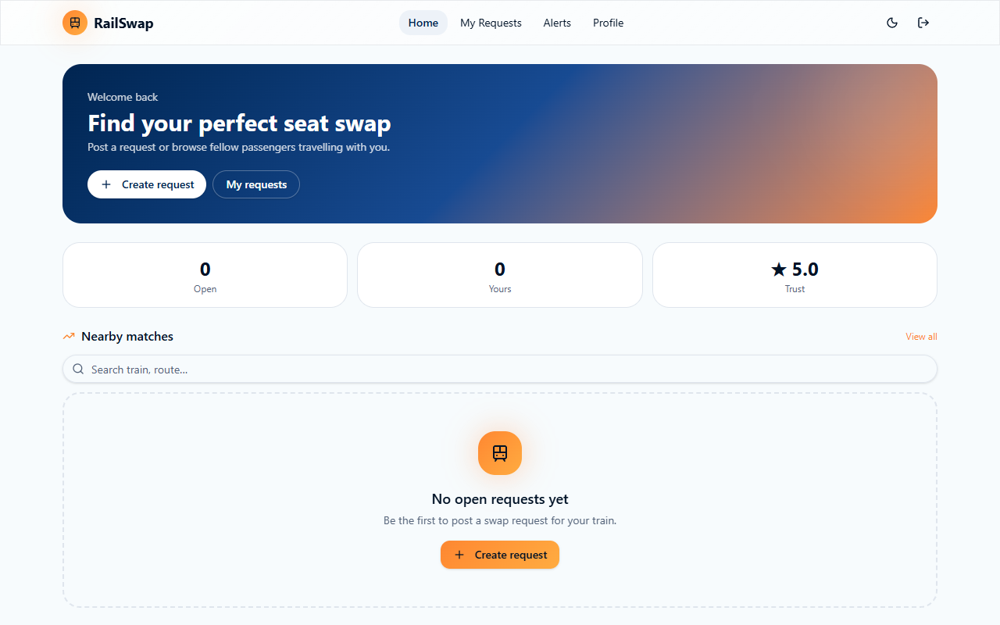
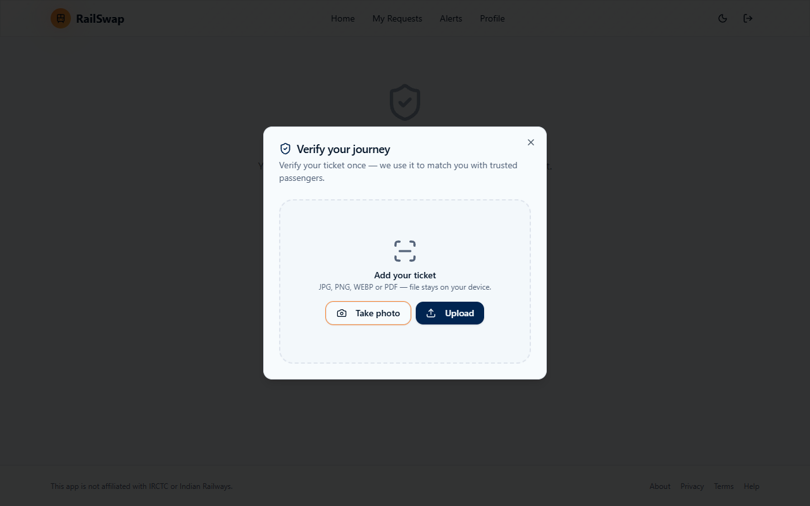
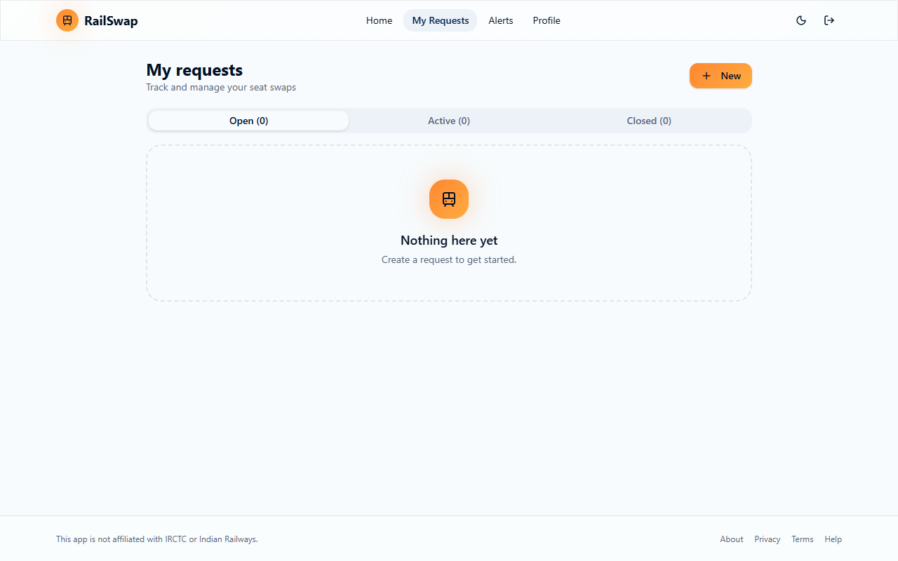
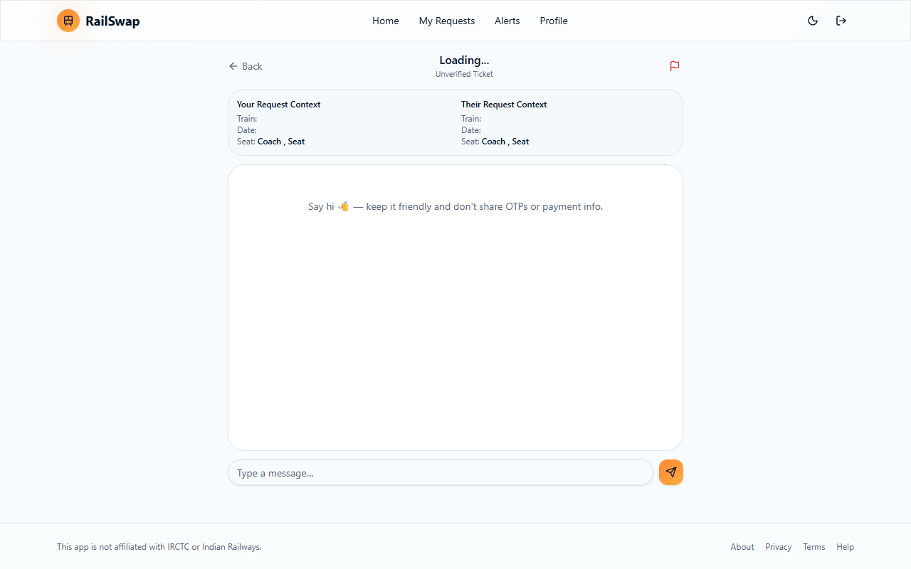

# Train Companion Hub - Rail Seat Swap

Train Companion Hub is a secure, AI-powered platform for verifying IRCTC train tickets and facilitating authorized, confirmed-ticket seat swaps between travelers. It provides a reliable way for passengers to request and exchange seats while ensuring all ticket data is verified through automated OCR (Optical Character Recognition).

## Key Features
- **OCR-Based Ticket Verification**: Upload your IRCTC ticket (PDF or image) and the system automatically extracts crucial journey details like PNR, Train Number, Boarding Station, Destination, Departure/Arrival times, Coach, and Seat numbers.
- **Confirmed Tickets Only**: Strict validation ensures that only confirmed (CNF) tickets for upcoming journeys are eligible for seat swapping.
- **Real-Time Communication**: Seamless chat interface built with Supabase for real-time message synchronization between passengers negotiating a swap.
- **Journey Data Integrity**: Verified ticket details cannot be tampered with manually, ensuring trust and security for all users.
- **Modern User Interface**: Built using modern web technologies to provide a smooth, fast, and responsive user experience across devices.

---

## 📸 Screenshots

*(Replace the placeholder images below with your actual screenshots)*

### 1. User Dashboard

*The main dashboard where users can view their current verified tickets and explore available seat swap requests.*

### 2. Ticket Upload and Verification

*Users upload their IRCTC ticket (PDF/Image) which is instantly scanned using OCR to extract the train details securely.*

### 3. Swap Request Details

*Detailed view of a seat swap request, showing exact coach, seat numbers, and journey timestamps.*

### 4. Real-time Chat Interface

*Passengers can securely chat in real-time to coordinate the seat swap before boarding the train.*

---

## 🚀 How to Use the Project

### Prerequisites
Make sure you have [Node.js](https://nodejs.org/) installed on your machine. This project also uses [Supabase](https://supabase.com/) for database and real-time features.

### Step 1: Clone and Install Dependencies
Open your terminal and navigate to the project directory:
```bash
cd train-companion-hub-main
npm install
# or if you use bun
bun install
```

### Step 2: Configure Environment Variables
You need to set up your environment variables for Supabase and any other required services.
1. Copy the `.env.example` file (if available) to `.env`.
2. Add your `VITE_SUPABASE_URL` and `VITE_SUPABASE_ANON_KEY` to the `.env` file.

```env
VITE_SUPABASE_URL=your_supabase_project_url
VITE_SUPABASE_ANON_KEY=your_supabase_anon_key
```

### Step 3: Run the Development Server
Start the Vite development server by running:
```bash
npm run dev
# or
bun run dev
```
The application will usually be available at `http://localhost:5173`.

### Step 4: Verifying a Ticket
1. Navigate to the **Scan/Upload Ticket** section.
2. Upload a clear image or PDF of your IRCTC e-ticket.
3. Wait for the OCR system to parse your ticket details. It will automatically extract your Coach, Seat Number, Boarding/Destination stations, and timings.
4. If the ticket is valid and Confirmed (CNF), it will be added to your verified journeys.

### Step 5: Initiating a Seat Swap
1. Once your ticket is verified, you can browse available swap requests on the same train.
2. If you find a suitable match (e.g., you want a Lower Berth and someone else wants an Upper Berth), you can click **Request Swap**.
3. This opens a real-time chat interface where you can communicate with the other passenger to confirm the swap.

## Tech Stack
- **Frontend Framework**: [React 19](https://react.dev/) with [Vite](https://vitejs.dev/) & [TanStack Start](https://tanstack.com/)
- **Styling**: [Tailwind CSS v4](https://tailwindcss.com/)
- **UI Components**: [Radix UI](https://www.radix-ui.com/) & [Lucide React](https://lucide.dev/) (Icons)
- **Backend/Database/Real-time**: [Supabase](https://supabase.com/)
- **OCR/Verification**: [Tesseract.js](https://tesseract.projectnaptha.com/) & [PDF.js](https://mozilla.github.io/pdf.js/)

## Contributing
Feel free to submit issues or pull requests to improve the platform.

## License
This project is open-source and available under the [MIT License](LICENSE).
